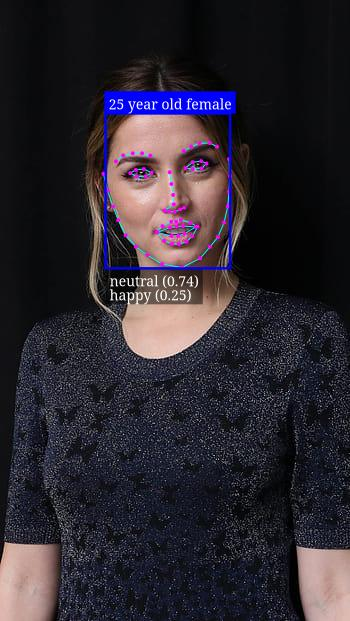
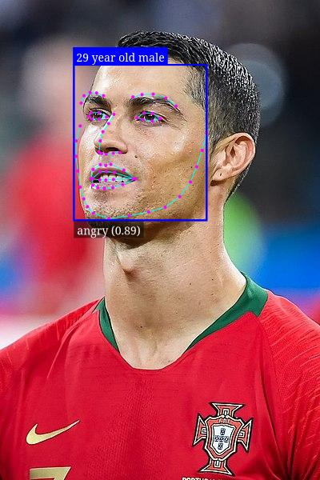
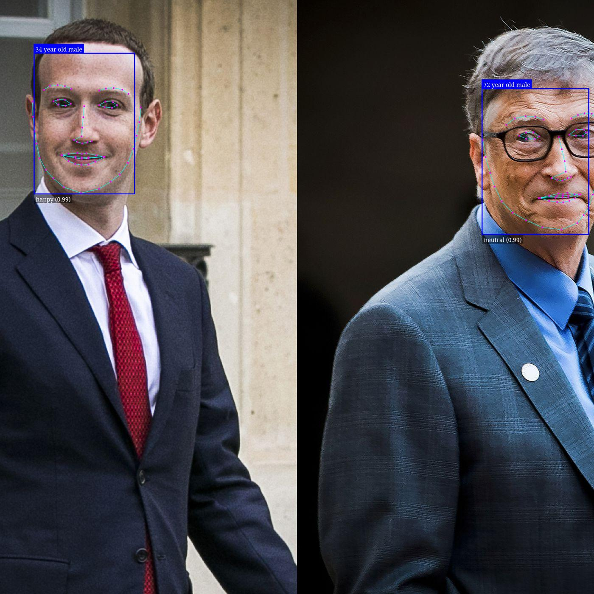

# Image Processing API with Face Detection and Emotion Analysis

This is a TypeScript-based RESTful API for image processing that includes features like face detection and emotion analysis. Users can register, login, generate API keys, upload images, and receive information about detected faces with their corresponding emotional states (e.g., happy, normal, angry, not happy).

## Prerequisites

Before you begin, ensure you have met the following requirements:

- Node.js and npm installed on your system.
- Git for cloning the repository.


## Demo 


### Face datection :










### APIs 

register :


login : 


## Getting Started

Clone the repository:

```bash
git clone https://github.com/BaseMax/ImageProcessingTSAPI.git
cd ImageProcessingTSAPI
```

Install dependencies:

```bash
npm install
```

## Configuration

Create a `.env` file in the project root and set the following environment variables:

```env
PORT=3000               # Port for the Express server
MONGODB_URI=   # MongoDB connection string
JWT_SECRET_KEY=             # Secret for JWT token generation
```

## Usage

**User Authentication**

Use the following endpoints for user registration and login:

- POST /api/auth/register for user registration.
- POST /api/auth/login for user login.

Authentication is required for the API key generation and image upload endpoints.

**API Key Generation**

After successful login, you can generate an API key by making a POST request to:

- POST /api/auth/generateApiKey

The generated API key should be included in the headers of image upload requests for authentication.

**Image Upload and Processing**

Upload an image and get face detection and emotion analysis results by making a POST request to:

- POST /api/upload/image

Include the API key in the headers to authenticate the request.

The API will return information about detected faces and their emotional states.

## Endpoints

**User Authentication:**

- POST /api/auth/register - Register a new user.
- POST /api/auth/login - User login.

**API Key Generation:**

- POST /api/auth/generateApiKey - Generate an API key for an authenticated user.

**Image Processing:**

- POST /api/face/detect - Upload an image for face detection and emotion analysis.

## Example

### Face Detection

The Image Processing API uses the face-api.js library for face detection. This library is a powerful tool for face detection and facial landmark recognition. Below, we'll provide more details and examples on how to use it.

### Face Detection Process

Uploading an Image: To detect faces in an image, you first need to upload an image to the API using the /api/upload/image endpoint.

Authentication: Ensure you include the API key in the headers of your request to authenticate.

Image Processing: The API will process the uploaded image and perform face detection using face-api.js.

Response: You will receive a JSON response containing information about the detected faces, including their positions and emotions.

Here's an example of the response you can expect from the API after uploading an image:

```json
{
  "faces": [
    {
      "position": {
        "top": 120,
        "left": 280,
        "width": 150,
        "height": 150
      },
      "emotions": {
        "happy": 0.75,
        "normal": 0.2,
        "angry": 0.05,
        "not_happy": 0.0
      }
    },
    {
      "position": {
        "top": 200,
        "left": 450,
        "width": 130,
        "height": 130
      },
      "emotions": {
        "happy": 0.6,
        "normal": 0.35,
        "angry": 0.03,
        "not_happy": 0.02
      }
    }
  ]
}
```

## Example Usage
Here's an example of how to make a POST request to the API to upload an image and receive face detection results using a JavaScript fetch:

```javascript
const apiUrl = 'http://your-api-url/api/face/detect';

// Replace 'your-api-key' with a valid API key.
const apiKey = 'your-api-key';

// Create a FormData object to send the image.
const formData = new FormData();
formData.append('image', imageFile);

fetch(apiUrl, {
  method: 'POST',
  headers: {
    'Authorization': `Bearer ${apiKey}`,
  },
  body: formData,
})
  .then(response => response.json())
  .then(data => {
    // Process the data, which contains face detection results.
    console.log(data.faces);
  })
  .catch(error => {
    console.error('Error:', error);
  });
```

## Contributing

Contributions are welcome! Please follow the Contributing Guidelines for this project.

## License

This project is licensed under the GPL-3.0 License - see the LICENSE file for details.

Copyright 2023, Max Base
